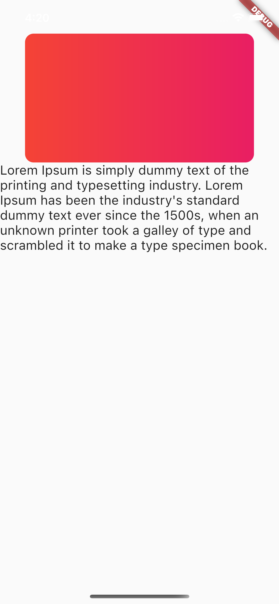
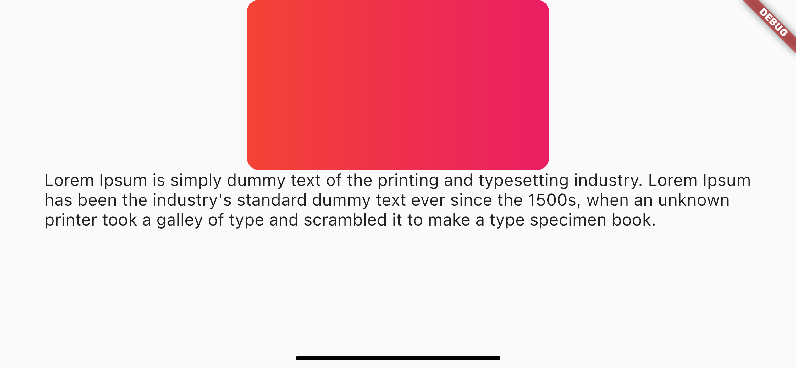
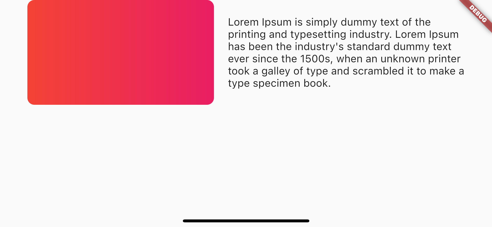

# Responsive Design - Flutter

A Flutter project to demonstrate responsiveness.

## Some general guidelines

- Don’t specify sizes until you really need them (don’t scale your app contents, keep the default sizes, because they are completely fine)

- Specify sizes for custom components (but freeze that size, don’t scale those sizes in larger devices)

- hard coded values for components are completely okay in mobile apps (don’t compare this with web app responsiveness)

- People buying bigger devices to see more content, not to increase size factors of the designs. (If you don’t believe me, check iOS default apps in different size devices)

- Just use space filling graphics if there are any empty spaces

- Change the layout based on the screen size. (Make the layout adaptive) Not the width and height of the components.

### References:

- [youtube: CodeX/flutter-responsive-design](https://www.youtube.com/watch?v=mlP5VPnxg7o&t=305s)
- [youtube: CodeX/mobile-app-design-guideline](https://www.youtube.com/watch?v=z7Vr0nsiKRQ&t=3091s)

<table>
    <tr>
        <td>  </td>
        <td>  </td>
    </tr>
    <tr>
        <td>  </td>
        <td>  </td>
    </tr>
</table>
